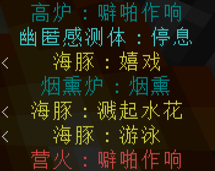
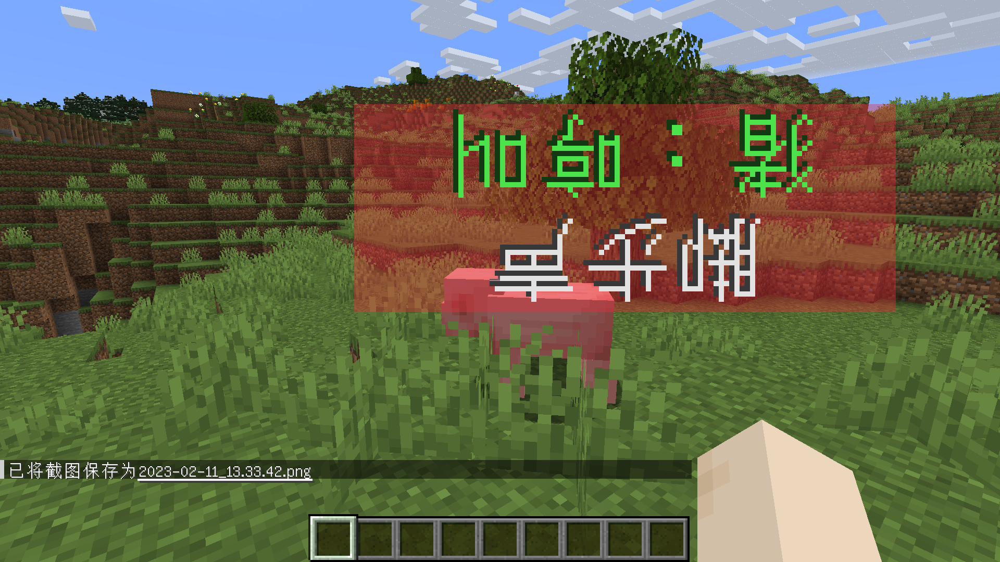

	<a href="./README-en.md"><b>English Version</b></a>

	

<h1 align="center">
	字幕高亮
</h1> 

	为不同字幕添加样式以区分，同时提供对单个字幕的自定义设置。

	
	
	

    
    
    
    

## 链接

[GitHub](https://github.com/Yeah-Zero/Subtitle-Highlight) [CurseForge](https://www.curseforge.com/minecraft/mc-mods/subtitle-highlight) [Modrinth](https://modrinth.com/mod/subtitle-highlight) [我的世界中文论坛](https://www.mcbbs.net/thread-1398903-1-1.html) [MC百科](https://www.mcmod.cn/class/8183.html)

[LyingChat的介绍视频（哔哩哔哩）](https://www.bilibili.com/video/BV14M41117mU/?t=89)

### 依赖项

Cloth Config（[GitHub](https://github.com/shedaniel/cloth-config) [CurseForge](https://www.curseforge.com/minecraft/mc-mods/cloth-config) [Modrinth](https://modrinth.com/mod/cloth-config)）

Fabric API（[GitHub](https://github.com/FabricMC/fabric) [CurseForge](https://www.curseforge.com/minecraft/mc-mods/fabric-api) [Modrinth](https://modrinth.com/mod/fabric-api)）

Fabric Loader（[官网](https://fabricmc.net/) [GitHub](https://github.com/FabricMC/fabric-loader)）

### 说明

此模组含有令部分人感到不适的彩蛋，可以通过配置屏幕中的”iKun彩蛋“关闭。

### 默认配置

配置文件保存在“<游戏目录>\config\字幕高亮.json”。

- 最长持续时间：3秒
- 起始比例：1
- 终止比例：0.29411764705882354
- 基本颜色设置
    - 环境：深蓝色
    - 方块
        - 通用：白色
        - 互动：天蓝色
        - 工作：湖蓝色
        - 危险方块：红色
        - 农作物：深绿色
        - 方块\_其它：深灰色
    - 魔咒：紫色
    - 实体
        - 生物
            - 玩家
                - 攻击：金色
                - 受伤：深红色
                - 玩家\_其它：白色
            - 被动生物：绿色
            - 中立生物：黄色
            - 敌对生物：红色
            - 头目生物：粉红色
        - 载具：灰色
        - 弹射物：金色
        - 爆炸物：红色
        - 装饰品：灰色
        - 实体\_其它：深灰色
    - 物品
        - 武器：金色
        - 防具：深绿色
        - 工具：蓝色
        - 物品\_其它：白色
    - 其它：白色
- 自定义列表
    - ……
    - ……
    - ……

